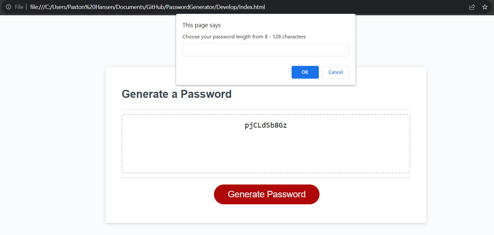

# PasswordGenerator User Story
AS AN employee with access to sensitive data 
I WANT to randomly generate a password that meets certain criteria 
SO THAT I can create a strong password that provides greater security

# PasswordGenerator Overview
The Password Generator is my simple web application that employees with access to sensitive data to generate strong and random passwords based on specific criteria. 

This tool enhances security by ensuring that passwords are not only long enough but also include a mix of different character types (e.g., lowercase, uppercase, numeric, special characters).

# HTML Explanation
The HTML code for the Password Generator consists of a simple web page structure. It includes:

- A 
 element with the class "wrapper" to contain the entire content.
- A <header> element to display the title "Password Generator."
- A 
 element with the class "card" to create a card-like container.
Inside the card, there's a <textarea> element with the ID "password" to display the generated password.
- A "Generate Password" button with the ID "generate" that users can click to initiate the password generation process.

# CSS Explanation
The CSS code provides styles and layout for the Password Generator web page. It includes:

- Styles for the card, header, wrapper, body and consistent box-sizing model
- Styles for the "Generate Password" button, setting its appearance, colors, and hover effects.
- Media queries to make the button and password field more responsive on smaller screens.

# Javascript Explanation
The JavaScript code is responsible for the core functionality of the Password Generator. It includes:

- Event listeners to handle button clicks.
- Functions to gather user input for password criteria (length and character types).
- Validation checks to ensure that user inputs are within acceptable ranges and that at least one character type is selected.
- Generation of a random password based on user-defined criteria.
Display of the generated password in the text area on the web page.

# Screenshot

# Link to App:
https://phansen47.github.io/PasswordGenerator/